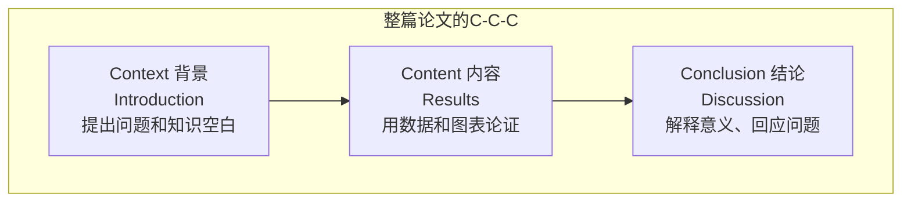
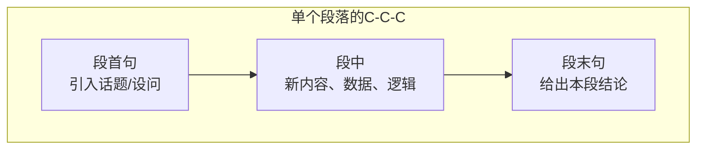
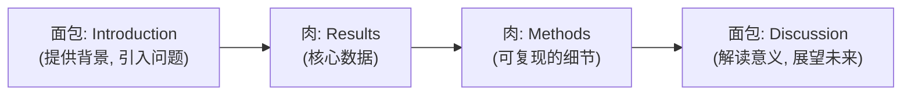
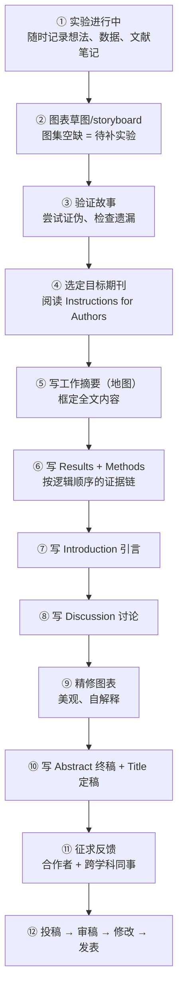
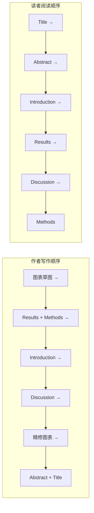
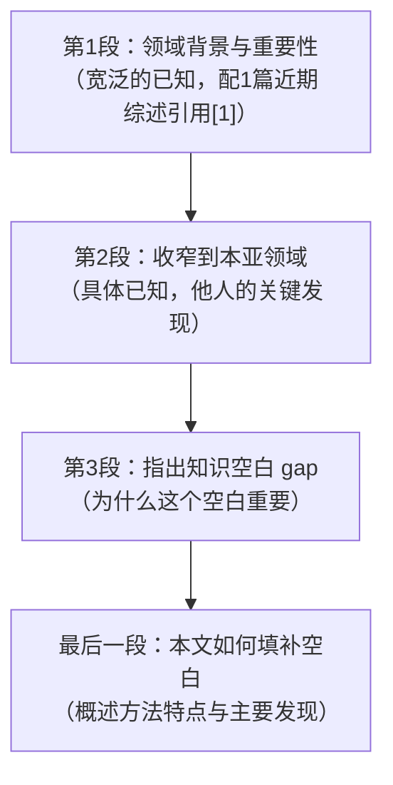

# 如何写好一篇科研论文 —— 写作方法总结

> 本文基于剑桥大学出版社 Bjorn Gustavii 的经典著作《How to Write and Illustrate a Scientific Paper》[1]、Nature Cancer 编辑社论《The craft (and art) of scientific writing》[2]、PLOS 的《Ten simple rules for structuring papers》[3] 与《Ten simple rules for writing research papers》[4]，并整合了 Science Careers 的职业专栏《How to write a research paper》[11]（多位一线科研工作者的实操经验）、Nature 职业专栏《The write stuff》[12]（多位编辑与写作教练的观点）以及 Matter 期刊 Sargent 教授的《10 tips on how we write papers》[13] 等权威资料。本文以 **"写作顺序"** 为主线，讲清楚"**什么时候写什么、为什么这么写**"。

---

## 一、先建立正确的心态：论文不是"记录"，而是"讲故事"

很多新手把写论文当作"实验流水账"：按做实验的时间顺序，把做过的事一件件写下来。这是最大的误区[1][3]。

**读者不关心你"怎么一步步做出来的"，只关心两件事：**
1. **你发现了什么**（核心结论，越简单越好记越好）；
2. **为什么可信**（支持结论的数据和逻辑）。

所以写作的本质是：**把按时间顺序展开的实验，重组成按逻辑顺序展开的论证**。好论文读起来像一篇侦探小说——先提出疑点（gap），再给出证据链，最后破案（结论）[3]。

> 💡 **一句话记住：** 论文写作 = 用"倒叙"的方式，把"正叙"的实验过程重新讲一遍。

---

## 二、论文写作的总思路：一条主线、三种尺度

### 2.1 贯穿一切的主线：C-C-C 结构（背景 → 内容 → 结论）

PLOS 的 Mensh 和 Kording 提出：几乎所有好故事都遵循 **Context（背景）→ Content（内容）→ Conclusion（结论）** 的结构[3]。科研论文也不例外，而且这个结构在**三个尺度**上都成立：

| 尺度 | 背景 Context | 内容 Content | 结论 Conclusion |
|---|---|---|---|
| **整篇论文** | Introduction（引言） | Results（结果） | Discussion（讨论） |
| **摘要** | 研究背景与空白 | 方法 + 主要结果 | 结论与意义 |
| **单个段落** | 段首句引出话题 | 段中呈现数据/论据 | 段末句给出结论 |

**写作提示：** 检查每一段，如果读者问"你为什么要告诉我这个？"（缺背景）或"那又怎样？"（缺结论），说明该段结构不完整[3]。

### 2.2 论文是一块"信息三明治"

Nature Cancer 编辑用了一个形象的比喻：论文像一块三明治——**最重要的部分是中间的"肉"（Results 和 Methods），两头夹着"面包"（Introduction 和 Discussion）**[2]。

这个比喻暗示了**精力分配**：花最多的时间打磨结果与图表（它们决定论文成败），引言和讨论重在"简洁而精准"。

---

## 三、写作流程：先做什么、后做什么、各部分何时写

### 3.1 全流程总览

### 3.2 关键问题：各部分的写作时机

这是大家最关心的部分。综合编辑学理论与一线实践者的经验，整理如下：

| 顺序 | 写什么 | 时机与理由 |
|---|---|---|
| **①** | **想法笔记**（非正式） | **实验进行中就写**。想法随时随地出现（床上、车上），随时记下来，一张纸一个想法，按论文章节分类存放[1]；同时用电子表格持续记录致谢名单与资助信息[11] |
| **②** | **图表草图**（storyboard） | **正文之前、甚至最终数据未齐时就先搭骨架**。Sargent 建议"从图表集开始"——图集中还空着的位置，就是下一步要补的关键实验[13]；用 PPT/手绘把图表按主题分组拼成故事板，能让你鸟瞰整个项目[11] |
| **③** | **验证故事（尝试证伪）** | **动笔之前**。用实验尝试证伪自己的结论、检查是否有重要遗漏，确保"有一个自洽的故事可讲"[11] |
| **④** | **"工作摘要"**（working abstract，草稿） | **写作之前写一版**。它像一个导航地图，告诉你论文里该放什么、不该放什么[1] |
| **⑤** | **Results 结果**（与 Methods 同步） | **正文第一块动笔**。它是"肉"，依据图表按逻辑顺序写[2]；实践者常把方法一并写、甚至先写方法——方法相对直接，且数据整理完毕时写方法只是把脚本"翻译"成故事[11] |
| **⑥** | **Introduction 引言** | **其次**。有了结果，才知道引言要"铺"到什么位置、引出什么问题[2]；写之前花一两天重新沉浸在文献里，刷新"我的工作在文献中的位置"[11] |
| **⑦** | **Discussion 讨论** | **再次**。把结果放回文献背景中解读，与引言前后呼应[2]；此时可以"关闭实验室活动"，专心写作[11] |
| **⑧** | **Methods 细节补齐** | **随结果同步开始，最后收尾**。理想状态是边做实验边记录；每得到一张最终图，就立即写出可复现的协议放入方法[11] |
| **⑨** | **Abstract 摘要（终稿）** | **倒数第二**。它必须准确浓缩全文，只能等全文定稿后再写[2]；实践者几乎一致"把摘要留到最后"[11] |
| **⑩** | **Title 标题（终稿）** | **早期占位、最后定稿**。项目一开始就给一个占位标题（提醒自己聚焦）[11]，写作收尾时再精修；标题是全文信息密度的极致[2][3] |
| **⑪** | **合作者/导师参与** | **大纲阶段就要介入**。先与导师共同确定大纲，能及早发现还缺哪些实验[11]；跨学科项目更要早征求合作者意见，确保故事线在多个学科都讲得通[11] |

> ⚠️ **关于摘要的"先后矛盾"解释：**
> - 早期写一个**工作摘要（working abstract）**：作为框架，帮你决定写什么、不写什么[1]；
> - 全文完成后，**重写/精修摘要**成终稿：因为只有论文写完了，摘要才能准确"浓缩"它[1][2]。
>
> 一句话：**先写草稿当"地图"，最后写终稿当"封面"。**

### 3.3 写作顺序 vs 读者阅读顺序（方向相反）

**为什么顺序正好相反？** 因为写作是"自下而上"地构建论证（先有数据、再有故事），而阅读是"自上而下"地消费结论（先看结论、再决定要不要看证据）。理解这一点，你就明白为什么标题和摘要要最后写——它们是你对整个故事反复打磨后的"提纯物"[2]。

---

## 四、各部分写作详解

### 4.1 开始之前：提炼"一句话故事"

动笔之前**不要写任何东西**，先做两件事[2]：

1. **客观地通览全部数据**，找出真正由数据支撑的核心科学信息。警惕"为了讲一个漂亮故事而选择未经充分验证的假设"——**数据永远是北极星（the data should always be the lodestar）**[2]。
2. **为论文确定一个核心贡献（one central contribution）**。一篇论文只讲一件事，贪多必失[3]。

> 💡 检验方法：写完初稿后，如果你不能在一分钟内跟同事讲清楚论文的核心思想，说明故事还没提炼到位[3]。

### 4.2 图表（Figures & Tables）：论文的骨架

**图表要早做、做好**——大多数读者会跳过正文直接看图[3]。图表有"两轮生命"：**草图**（搭骨架、定逻辑）和**精修图**（投稿前最后完成）[11][13]。

- **草图阶段**：从图表集开始，先不追求美观，重点是让"看图即知故事"成立；图集中的空缺就是待补的关键实验[13]；用 PPT 按主题分页拼故事板，把握全局[11]；
- **精修阶段**：正文基本定稿后再精修图表，确保视觉美观、轴标签和列标题齐全、**脱离正文也能被读懂**（图注自解释）[11]；
- 每个图一个**结论式标题**（告诉读者"结论是什么"），图注解释"怎么做出来的"[3]；
- **图表的呈现顺序不要按数据采集的时间顺序**——这是新手最常见的错误，应按逻辑重新排序[11]；
- 表格放"细节"，正文强调"要点"，**不要在正文里重复表格里的每个数字**[1]；
- 制图可参考 Edward Tufte 的经典著作[8]。

### 4.3 Introduction 引言：漏斗式收窄

引言的目标是让读者（包括非专家）理解：**大背景是什么 → 已知什么 → 缺什么（gap）→ 本文做什么**。它通常不超过一页（双倍行距）[1]，用"漏斗"结构逐段收窄[3]：

写作要点：
- **三段式内容**：(1) 研究的问题或假设；(2) 你要挑战或发展的他人具体发现；(3) 你所用方法的主要特点[1]；
- **不要穷尽式文献综述**，只引最相关、最新的文献，正面回应领域内的争议[2]；
- 实践者常把引言拆成三个小段：基础背景知识 → 与本研究模型/结果相关的具体方面 → 主要发现与简要结论[11]；
- 引言最后一段可简要预览本研究的结果（比摘要更具体，但不必重复背景）[3]；
- **重要技巧**：如果发现一篇与你高度相似的近期文献，应该把它放在**引言前部**引用，而不是"藏"在讨论深处——编辑和审稿人熟知这种"埋引用"的把戏（reference-13 trick），坦诚引用反而赢得信任[1]。

### 4.4 Methods 方法：详细到可以复现

- 写到**别人能照做并复现你的结果**的程度，这是科学可重复性的底线[2]；
- 最好**边做实验边写**（记录试剂、参数、分析流程），避免事后遗忘细节[2]；
- 若期刊要求，涉及临床研究须遵循 CONSORT 等报告规范[5]；
- 遵守期刊的伦理、数据可用性等政策要求[2]。

### 4.5 Results 结果：按逻辑顺序的"证据链"

结果部分要说服读者"核心结论有数据和逻辑支撑"[3]。

- **开头段**：概述总体研究思路和关键方法创新（因为多数读者不读 Methods，这给了他们方法大意）[3]；
- **按逻辑而非时间顺序**组织，可以用结论式小标题/分节；每小节 = 一个逻辑步骤[3]；
- **每段的套路**：段首设问（如"我们接着检验了 X 是否影响 Y"）→ 段中呈现数据和证据 → 段末回答该问题[3]；