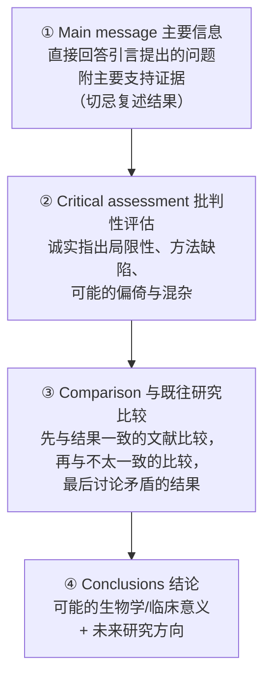
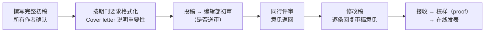

- **不仅报数据，还要交代逻辑**：每个实验给出简短的原理、假设和实验设置说明，帮读者跟上你的思路[11]；
- **主要发现放最前**，按兴趣递减的顺序排列[1]；
- 正文只强调要点，**不要逐字重复表格内容**；如：

  ❌ "如表1所示，自杀组6例患者夜间血浆褪黑素浓度为 19.0 ± 11.9 pg/mL，对照组22例为 45.5 ± 27.1 pg/mL（P < 0.05）。"
  ✅ "曾有自杀史的患者夜间血浆褪黑素浓度显著低于对照组（P < 0.05）（表1）。"[1]
- 报告**精确 P 值**和**置信区间**，让读者自己判断临床/实际意义[1]；
- **副作用/不良结果也要如实充分报告**——它可能正是研究最重要的部分[1]。

### 4.6 Discussion 讨论：四段式结构

读者（尤其是匆忙的读者）往往直接翻到讨论最后一段找结论。Gustavii 推荐的四段式结构[1]：

写作要点：
- **开头切忌复述结果**——读者已在摘要和结果部分看过两遍了。直接给答案[1]；
- **把结果放进"全球背景"**：大量手稿因为讨论薄弱被拒——作者显然没吃透现有文献。要展示结果在全球背景下的意义与原创性[12]；
- **解释数据如何支撑论断、支撑到什么程度**，并考虑替代解释，向读者证明结论的稳健性[11][12]；
- 评价**研究本身**，不要评价作者（"敏锐的观察"这类话留给读者说）[1]；
- **避免宣称"首次"**（"Our study appears to be the first…"）。多数研究都有独特设计，宣称首创容易被读者抓包，反而损害可信度。用引言说明你的设计与既往工作的差异即可[1]；
- **避免夸大（hype）**：强调发现重要性的同时，必须承认其局限[2]；推测与基于证据的结论之间只有一条窄线——可以推测，但不要通篇推测[12]；
- **结论段**：用一到两句说明未来研究计划与尚待探索的问题[12]。

### 4.7 Abstract 摘要：论文的"微缩版"

- 无论传统式还是结构化摘要，都包含**四个基本要素**：背景（含研究目的）、方法、结果、结论[1]；
- 摘要对大多数读者而言是**唯一会读的部分**，必须自成一体、传达完整信息[3]；把摘要当作"电梯演讲"——用 2~3 句话覆盖每个主要部分，让读者判断是否值得读全文[11]；
- 摘要中如出现缩写，**必须解释**（因为摘要会被独立收录在检索数据库中）[1]；
- 结构上采用"宽 → 窄 → 宽"：开头交代背景与空白，中间是方法+结果，结尾是结论与更广泛的意义[3]；
- **关键词（keywords）也很重要**：要简洁、不与标题重复、用读者会搜索的常见词[11]。

### 4.8 Title 标题：信息密度最高的地方

- 标题是读者最先接触的元素，决定读者是否愿意读摘要[3]；
- **用短标题直接描述结果**的论文被引用更多[7]；简洁、声明式的标题也更容易进入 Altmetrics 关注榜（社交媒体/大众媒体传播）[15]；
- 给标题一个"巧思"（twist）可以让论文更容易被找到、被记住——可以召集所有合作者头脑风暴[11]；
- 标题也是你写作时的"定海神针"——提醒自己全文始终围绕这一个核心贡献[3]。

### 4.9 叙事与文风：让论文"有故事"但保持克制

结构决定了论文的骨架，而叙事与文风决定读者愿不愿意读下去。多位编辑与写作教练给出了高度一致的建议：

- **最好的叙事几乎从不按时间顺序**：你真实的实验历程（想法→失败→另一个想法→发现是伪迹→……）照实写出来，读者很难跟上。要围绕大纲重新编排，让叙事流畅、易跟、吸引人[13]；新手最常见的错误之一就是按数据采集的时间顺序组织图表[11]；
- **给论文一个"情节"**：好论文往往有起承转合——挣扎与失望 → 好奇心驱动的研究 → 由洞察驱动的创新 → 最终成就。把早期的失败尝试写进故事，能制造戏剧张力，并凸显你的成功绝非平凡[13]；
- **"危害"与"治愈"要相称**：开篇提出的问题有多大（harm），结尾的解决就要有多大（cure），且两者都要精确表述——问题说"全球每年排放 390 亿吨 CO₂"，结尾就得拿出足以匹配的答案，反之亦然[13]；
- **站在巨人的肩膀上，然后清晰划界**：文献综述要对前人慷慨；用新段落、变换动词时态等标记，清楚区分"前人工作"与"你的原创工作"[13]；
- **找到"红线"（red thread）**：明确回答"有什么新东西、为什么引人注目"（What's new and compelling?），让这条红线从引言贯穿到结论；每个段落都是红线上的一环[12]；
- **大胆陈述，但不过度**：科学家常因害怕批评而写得防御、臃肿——过多限定语和长清单，仿佛在预演尚未到来的批评。要像对"人"写作，而不是对"期刊守门人"写作[12]；同时避免结论过度自信[12]；
- **警惕"僵尸名词"（zombie nouns）**：implementation、application 这类名词化表达会吸走主动动词的生命力。科学写作要事实、简洁、有证据，但不必干瘪——可以用原创的声音和生动的语言，前提是不要耸人听闻[12][14]；
- **克制修饰（purple prose）**：论文的目的是传达信息。修饰语分散注意力，比喻可能迷惑非英语母语读者——让文字"只复杂到需要的程度"[12]；
- **读者是忙碌疲惫的人**：清晰是科学写作者的唯一义务。读者的任务是"注意并记住"，作者的任务是让这两件事变得容易[12]；
- **根据期刊受众调整语言**：面向不同领域读者时，要解释在本领域是常识、在外领域不是的术语[11]。

### 4.10 参考文献

- 只引**精选的、相关的**文献，不要贪多（Incisive referencing）[2]；
- 引文要**完整**（含标题），格式按期刊要求，投稿阶段可用任意完整格式[2]；
- 尽早建立文献库（如 Zotero/EndNote），随着写作推进不断精简到"必需的引用"[2]。

---

## 五、写作习惯与时间管理（编辑的实战建议）

1. **边做实验边攒想法**：灵感随时出现，用笔记本/活页夹按论文章节分类收集，一张纸一个想法[1]。
2. **分段写作、每天少量**：不要试图"请两周假一次性写完"。专业作者每天只能高质量创作几小时。每次只写一个部分（如引言），写完一个部分就停——"永远在高潮处停止"（海明威）[1]。
3. **写作前先读**：每次动笔前，先读改上次写的内容，再读你为这部分收集的笔记；结束时花 20 分钟为下一部分列个提纲[1]。
4. **先提纲后正文**：为每个计划写的段落写一句非正式的话（一句话提纲），比直接遣词造句高效得多[3]。
5. **修改是常态**：初稿手写也可以，但修改一定要用文字处理器；大改前**另存副本**，以备反悔[1]。
6. **主动寻求反馈**：请信得过的**非作者**（不被主题"洗脑"的人）阅读，他们能提供客观批判；收到"笼统的、不热情的"审稿意见，往往说明审稿人没抓住你的主线[3][10]。反馈圈子不要限于直接合作者——**跨学科同事**常能发现你忽略的问题，英语母语的朋友帮忙润色也很有效[11]。
7. **放一放再改**：搁置一段时间再回来看自己的文章，能获得客观视角[2]。
8. **保持自己的声音**，但对合作者、审稿人、编辑的建议保持开放[2]。
9. **用检查清单给自己动力**：面对空白页无从下手时，清单能帮你选择下一步任务，缓解写作焦虑；找到自己最高效的时间段（比如早晨第一杯咖啡后）[11]。
10. **卡住时换任务**：写作卡壳时，去读文献或打磨图表，既能放松又能提供新的写作起点[11]。
11. **不要追求完美手稿**：手稿永远可以更好，但"掉进不断返工的兔子洞"会阻止重要结果面世——记住：**世界上不存在完美手稿**[11]。

---

## 六、编辑视角：常见错误"黑名单"

1. **摘要缺背景或结论**——传统式摘要最常见的致命伤[1]。
2. **正文重复表格**——文字应强调要点而非复述数字[1]。
3. **基线特征只用"16名健康志愿者"一笔带过**——对照组描述敷衍是拒稿常见原因，对照组应与实验组同等详细[1]。
4. **高脱落率（≥15%）不说明**——脱落者应纳入"意向性分析（intention-to-treat）"并说明原因[1]。
5. **百分比不规范**：总数 < 25 就不要用百分比；数据永远要带原始数值（"209 (7.2%) of 2901 patients" 而非 "7.2% (209)"）[1]。
6. **数字不规范**：小数点用点不用逗号；千位用空格（12 345 而非 12,345）；句首数字用文字；相邻两个数字要分开（two 500-mg tablets）[1]。
7. **宣称首创 / 评价作者 / 夸大意义**——编辑与审稿人非常反感[1][2]。
8. **排版脏乱**：编辑经验表明"稿件准备潦草 ≈ 科学粗糙"，干净的排版会赢得编辑好感[1]。
9. **结构混乱（zig-zag）**：每个主题只在一个地方讲，不要来回跳跃；平行的观点用平行的句式[3]。
10. **滥用缩写**：读者记不住，需要回翻。宁可多写几个单词[3]。
11. **按数据采集的时间顺序呈现图表/结果**——新手最常见错误，应按逻辑顺序重排[11]。
12. **防御性写作**：过多限定语与长清单，"仿佛在预演尚未到来的批评"，导致散文浑浊；要自信陈述[12]。
13. **满纸"僵尸名词"**：名词化表达（implementation、application 等）吸走动词的生命力，让文字干瘪难读[12][14]。
14. **方法部分省略关键信息**：导致研究无法复现——这等于让研究走进死胡同[12]。
15. **讨论薄弱**：作者显然没吃透文献、说不出结果的意义，是大量手稿被拒的直接原因[12]。

---

## 七、投稿与修改（简要路线）

- Cover letter 要清晰说明工作的**重要性**（significance）[2]；
- **Cover letter 与正文不要重复**：编辑会同时读两者。投稿信应更吸引人、更通俗、更"宏观"（zoomed out），并放一个视觉元素（图表/表格）展示核心新思想与相对既往研究的量化提升[13]；
- **主动建议审稿人**：推荐约 10~12 位你领域内外最严谨、最专业的专家——哪怕是你的直接竞争对手（"Team of Rivals"策略）。这既换来高质量反馈，也向编辑传达你的信心；注意审稿人名单的多样性（学科、地域、性别、职业阶段）[13]；
- 修改稿要**逐条、礼貌、有依据地**回复审稿意见（Gustavii 书中有专章），这是决定成败的一步[1]；
- **以建设性视角解读审稿意见**：苛刻的语言里往往藏着"误解的线索"——那是提升清晰度的机会；尽量不与审稿人争论，而是展示"我们如何根据反馈精神改进了工作"[13]；
- **90% 完美时就投稿**：审稿人总会提出新要求，这恰恰是审稿的价值。留一点改进空间，让审稿人给出可执行的反馈[13]；
- 如果文章被拒，认真吸收意见，转投前按目标期刊要求调整格式[2]。

---

## 八、速查表：写作顺序"十二步法"

| 步骤 | 内容 | 一句话要点 |
|---|---|---|
| 1 | 记想法 | 实验期间随时记录，按章节分类[1] |
| 2 | 做图表草图 | 图表=骨架，从图集开始，空缺=待补实验[13] |
| 3 | 验证故事 | 尝试证伪结论，确保故事自洽[11] |
| 4 | 写工作摘要 | 当"地图"，框定全文内容[1] |
| 5 | 写 Results + Methods | 同步进行，按逻辑顺序组织证据链[2][11] |
| 6 | 写 Introduction | 漏斗式，落在 gap 上[2][3] |
| 7 | 写 Discussion | 四段式，从答案到展望[1] |
| 8 | 精修图表 | 美观、自解释、脱离正文可读[11] |
| 9 | 写 Abstract 终稿 | 电梯演讲，浓缩全文[2][11] |
| 10 | 定 Title | 短而声明式，突出新意[7][15] |
| 11 | 征求反馈 | 跨学科同事 + 英语母语朋友[11] |
| 12 | 投稿 | Cover letter 不重复正文，90%完美即投[13] |

---

## 参考文献

[1] Gustavii, B. *How to Write and Illustrate a Scientific Paper*. 3rd ed. Cambridge University Press, 2017. DOI: [10.1017/9781316650431](https://doi.org/10.1017/9781316650431)

[2] Nature Cancer Editorial. The craft (and art) of scientific writing. *Nature Cancer* 4, 583–584 (2023). DOI: [10.1038/s43018-023-00579-y](https://doi.org/10.1038/s43018-023-00579-y)

[3] Mensh, B., Kording, K. Ten simple rules for structuring papers. *PLoS Computational Biology* 13(9): e1005619 (2017). DOI: [10.1371/journal.pcbi.1005619](https://doi.org/10.1371/journal.pcbi.1005619)

[4] Zhang, C. Ten simple rules for writing research papers. *PLoS Computational Biology* 10(1): e1003453 (2014). DOI: [10.1371/journal.pcbi.1003453](https://doi.org/10.1371/journal.pcbi.1003453)

[5] Schulz, K. F., Altman, D. G., Moher, D., & CONSORT Group. CONSORT 2010 statement: updated guidelines for reporting parallel group randomised trials. *BMJ* 340, c332 (2010). DOI: [10.1136/bmj.c332](https://doi.org/10.1136/bmj.c332)

[6] Moher, D., Liberati, A., Tetzlaff, J., Altman, D. G., & PRISMA Group. Preferred reporting items for systematic reviews and meta-analyses: the PRISMA statement. *PLoS Medicine* 6(7): e1000097 (2009). DOI: [10.1371/journal.pmed.1000097](https://doi.org/10.1371/journal.pmed.1000097)

[7] Paiva, C. E., Lima, J. P. S. N., & Paiva, B. S. R. Articles with short titles describing the results are cited more often. *Clinics* 67(5), 509–513 (2012). DOI: [10.6061/clinics/2012(05)17](https://doi.org/10.6061/clinics/2012(05)17)

[8] Tufte, E. R. *The Visual Display of Quantitative Information*. 2nd ed. Graphics Press, 2001.

[9] Strunk, W., Jr., & White, E. B. *The Elements of Style*. 4th ed. Longman, 1999.

[10] Bourne, P. E. Ten simple rules for getting published. *PLoS Computational Biology* 1(5): e57 (2005). DOI: [10.1371/journal.pcbi.0010057](https://doi.org/10.1371/journal.pcbi.0010057)

[11] Pain, E. How to write a research paper. *Science* Careers (2023). DOI: [10.1126/science.caredit.adi0662](https://doi.org/10.1126/science.caredit.adi0662)

[12] Gewin, V. The write stuff: how to produce a first-class paper that will get published, stand out from the crowd and pull in plenty of readers. *Nature* (2018). DOI: [10.1038/d41586-018-02404-4](https://doi.org/10.1038/d41586-018-02404-4)

[13] Sargent, E. H. 10 tips on how we write papers. *Matter* 5(10) (2022). DOI: [10.1016/j.matt.2022.09.025](https://doi.org/10.1016/j.matt.2022.09.025)

[14] Doubleday, Z. A., Connell, S. D. Publishing with objective charisma: breaking science's paradox. *Trends in Ecology & Evolution* 32(11), 803–805 (2017). DOI: [10.1016/j.tree.2017.06.011](https://doi.org/10.1016/j.tree.2017.06.011)

[15] Di Girolamo, N., Reynders, R. M. Health care articles with simple and declarative titles were more likely to be in the Altmetric Top 100. *Journal of Clinical Epidemiology* 85, 32–36 (2017). DOI: [10.1016/j.jclinepi.2016.11.018](https://doi.org/10.1016/j.jclinepi.2016.11.018)

---

*说明：本总结的正文观点主要依据文献 [1][2][3][4][11][12][13]；[5][6] 为涉及临床/系统综述研究时的报告规范；[7][8][9][10] 为辅助参考（标题策略、制图、文风与发表流程）；[14][15] 为文风与标题相关研究的原始文献。*
